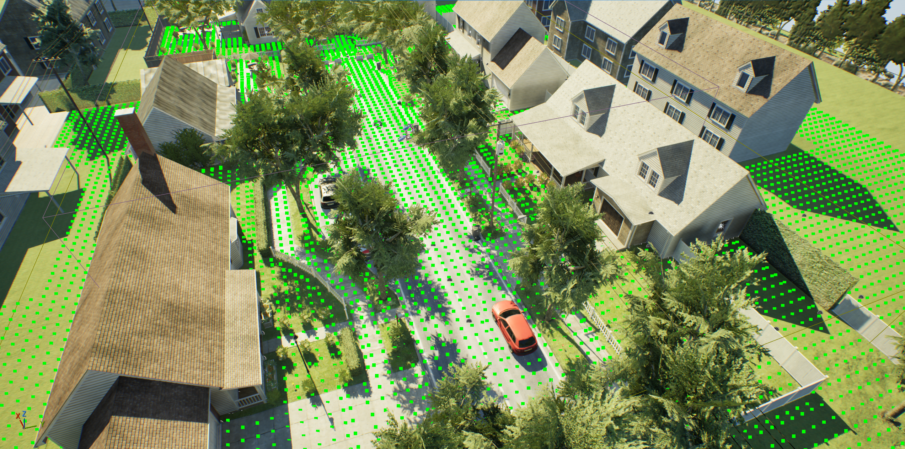

# NavMeshSampler

An Unreal Engine 5 plugin for sampling placement candidate points from navigation mesh data.



## Features

- **Grid-based NavMesh sampling** - Extract valid placement points from NavMesh
- **Connectivity-based filtering** - Automatically filter out isolated surfaces (rooftops, car tops, etc.)
- **World collision filtering** - Optional filtering for points under overhangs/obstacles
- **JSON export** - Export sampling results for external use
- **Editor visualization** - Visualize sampled points in the viewport

## Installation

1. Clone or download this repository
2. Place the `NavMeshSampler` folder into your project's `Plugins/` directory
3. Restart Unreal Editor or regenerate project files

## Requirements

- Unreal Engine 5.7+
- NavMesh data exported in Detour binary format (.bin)

## Usage

### 1. Open the NavMesh Sampler Panel

In Unreal Editor: **Window > NavMesh Sampler**

### 2. Select NavMesh File

Click **Browse...** and select a `.bin` NavMesh file.

### 3. Configure Parameters

| Parameter | Description | Default |
|-----------|-------------|---------|
| Grid Spacing | Distance between sample points (cm) | 100 |
| Min Clear Height | Minimum vertical clearance for world filtering (cm) | 200 |

### 4. Sample Points

Click **Sample Points** to perform grid-based sampling. The plugin will:
1. Load the NavMesh data
2. Identify the largest connected region (ground)
3. Sample points and filter out isolated surfaces
4. Display results in the panel

### 5. Optional: Filter by World Collision

Click **Filter Overhangs** to remove points under low obstacles (eaves, roofs, etc.).

### 6. Export Results

Click **Export to JSON** to save sampling results.

## Output Format

```json
{
  "totalPoints": 49266,
  "validPoints": 28182,
  "totalArea": 130775848,
  "bounds": {
    "min": [-10868, -5928, -15],
    "max": [9880, 4940, 665]
  },
  "points": [
    {
      "location": [4750, -5110.5, 55],
      "isValid": true
    }
  ]
}
```

## How It Works

### Connectivity-Based Filtering

The key innovation of this plugin is **connectivity-based filtering**:

1. **Problem**: NavMesh contains surfaces on rooftops, car tops, and other elevated objects that shouldn't be used for ground placement.

2. **Solution**: These isolated surfaces are disconnected from the main ground NavMesh. By finding the largest connected region, we identify the actual ground.

3. **Advantage**: Works for maps with varying terrain heights without requiring manual height configuration.

```
Rooftop NavMesh (isolated) ----X---- Filtered out
         │
         │ (not connected)
         │
Ground NavMesh (connected) ----> Kept as valid points
```

## Blueprint API

```cpp
// Sample points from NavMesh file
UFlibNavMeshSampler::SamplePointsFromNavMeshFile(NavMeshPath, Config, Result);

// Sample within a specific region
UFlibNavMeshSampler::SamplePointsInRegion(NavMeshPath, Region, Config, Result);

// Filter by world collision
UFlibNavMeshSampler::FilterPointsWithWorldCollision(WorldContext, Result, FilterConfig);

// Export to JSON
UFlibNavMeshSampler::ExportSamplingResultToJSON(Result, FilePath);

// Get valid point locations
UFlibNavMeshSampler::GetValidPoints(Result);
```

## Coordinate System

This plugin handles coordinate conversion between Recast and Unreal coordinate systems:

| Recast | Unreal |
|--------|--------|
| X | -X |
| Y | Z |
| Z | -Y |

## Dependencies

- `NavigationSystem` module
- `Navmesh` module (includes Detour)
- `Json` module

## License

MIT License

## Acknowledgments

- Uses Recast/Detour navigation library